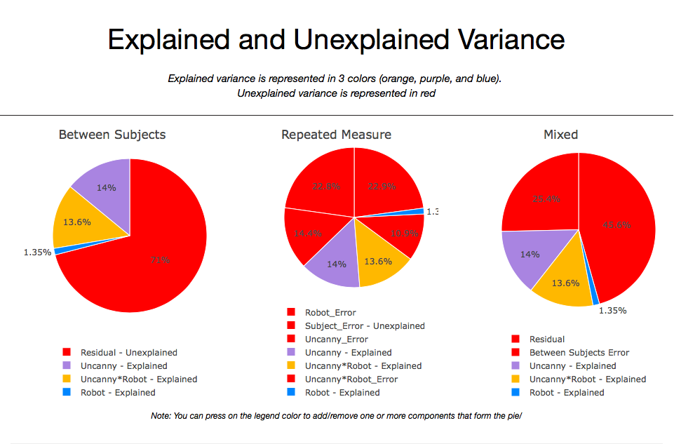

# Motivation:

The purpose of this app is to provide undergardaute and graduate students, as well as apsiring young scientists, with an interactive tool to better understand the different types of analysis of variance (ANOVA). This app allows users to visualize how the variance changes as a function of the number of observations,within subject correlation, the mean, and standard deviation that they select.

# Data:
Since there is no actual dataset that looks at the empathic response of humans after seeing a robot tripping, I decided to simulate a dataset to address this context. I'm mainly interested to simulate how robot design (humanoid vs. mechanical robot) and its level of uncanniness (low, medium, and high) would affect people's empathic response to a robot that trips while walking. My hypothesis is that the more human like the robot is, and the less uncanny it appears to be,the higher the empathic response would be towards it. Accordingly, I expeect to see humanoid robots with low uncanny to trigger higher feelings of empathy when compared to other robots of different levels of uncanniness.

# Design:
This hypothetical study is based on 2 (robot type) x 3 (Uncanny levels) design.

You can access the app by following this [link]()

For information on how to upload an Shiny app to [shinyapps.io](https://shiny.rstudio.com/articles/shinyapps.html), please press on this [link](https://shiny.rstudio.com/articles/shinyapps.html)

# Screenshot:

